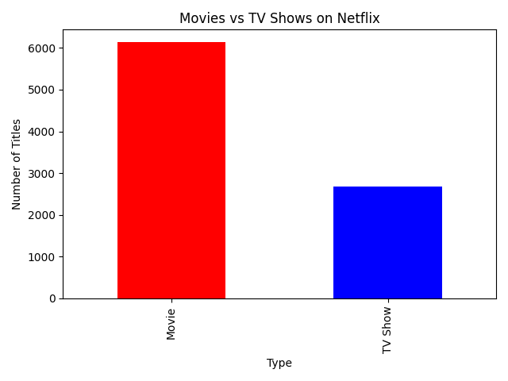
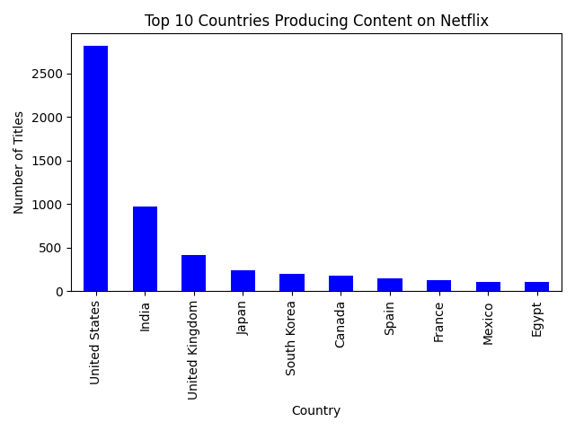

# 🎬 Netflix Movies and TV Shows Analysis

A data analytics project exploring trends, genres, and global reach of Netflix content using Python, Pandas, and Seaborn.

---

## 📊 Project Overview

This project analyzes a publicly available Netflix dataset from Kaggle, with the goal of identifying content trends such as:

- Distribution of Movies vs TV Shows
- Trends in content releases by year
- Most popular content ratings (PG, R, etc.)
- Top countries producing Netflix content
- Most common genres

---

## 🧰 Technologies Used

- Python
- Pandas & NumPy
- Matplotlib & Seaborn
- Jupyter Notebook / Google Colab

---

## 📁 Dataset

**Source**: [Netflix Movies and TV Shows | Kaggle](https://www.kaggle.com/datasets/shivamb/netflix-shows)  
**File**: `netflix_titles.csv`

---

## 📌 Key Findings

- 🧮 Netflix has more Movies than TV Shows (~70%).
- 🌍 The United States is the leading producer of Netflix content.
- 🕰️ Content release peaked around 2018-2019.
- 📺 Most shows are rated TV-MA or TV-14.
- 🎭 Dramas are the most common genre.

> Visuals are included in the notebook for deeper insights.

---

## 📸 Sample Visualizations

*Add your plots as images using the Jupyter “Save As PNG” function and upload to a `images/` folder.*

---

## 🚀 How to Run

1. Clone this repository
2. Install the requirements (optional)
3. Open the notebook `netflix_analysis.ipynb`
4. Run all cells to view the analysis

---

## 🧠 Future Work

- Perform sentiment analysis on Netflix descriptions
- Integrate IMDb ratings for deeper insights
- Create an interactive dashboard (e.g., with Plotly or Dash)

---

## 📄 License

This project is under the MIT License. Dataset is publicly available via Kaggle.

---

## 🙋‍♂️ Author

**Your Name**  
- GitHub: https://github.com/rezowanrahat 
- LinkedIn: [https://www.linkedin.com/in/rezowan-khan/]
